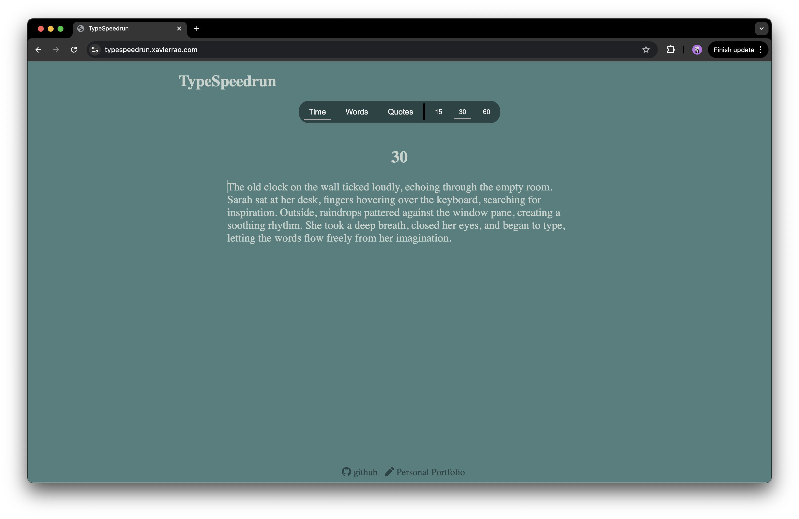

# TypeSpeedrun

## Disclaimer: This project is still a work in progress. While the core features are functional, there may be bugs or unfinished elements. Future updates and improvements are planned.

TypeSpeedrun is an interactive typing game that challenges users to improve their typing speed and accuracy. Choose between different modes, such as timed tests, word counts, or quotes of varying lengths. Track your words per minute (WPM) and accuracy as you type!

## Features
- **Multiple Modes**: Choose between time-based, word count, or quotes-based modes.
- **Real-time Feedback**: View your typing accuracy and speed as you type.
- **Dynamic Timer**: Track your performance against a countdown timer.
- **Stats Display**: After completing the test, see your results with WPM, accuracy, and test type.
- **New Game**: Restart the game anytime with a new challenge.

## How to Play
1. **Select Your Mode**: Choose between the following modes:
- **Time**: Set the time limit for your typing test (15, 30, or 60 seconds).
- **Words**: Select a word count (10, 25, or 50 words).
- **Quotes**: Pick a quote length (short, medium, or long).
2. **Start Typing**: Once you start, type the displayed text as quickly and accurately as possible.
- Correct words will be highlighted in green.
- Incorrect words will be highlighted in red.
3. **Track Your Progress**: As you type, your WPM (words per minute) and accuracy are calculated in real-time.
4. **End the Test**: The test ends when the timer runs out or when you finish typing the assigned words.
5. **View Results**: After completing the test, check your stats: WPM, accuracy, and test type.
6. **New Game**: Start a new game by clicking the "New Game" button.

## Play Online
You can play the game directly in your browser by visiting: [TypeSpeedrun](https://typespeedrun.xavierrao.com)

## Technologies Used
- **HTML**: For the structure of the website.
- **CSS**: For the styling and layout of the website.
- **JavaScript**: For the interactivity and game logic, such as timer countdown, key events, and result calculations.
